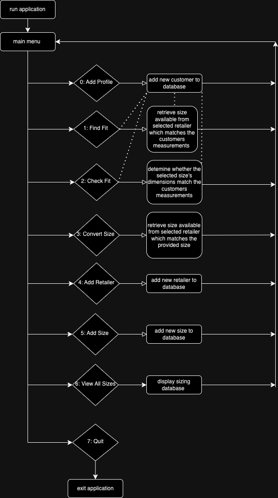

# size o matic
## introduction 

The environmental costs of fast fashion are significant and rising. 

Ill-fitting garments add to this cost as often ill-fitting garments :
- remain unworn and are discarded 
- are returned to the retailer and discarded

Despite this purchasing a well-fitting garment online is complicated by inconsistencies in sizing across brands and retailers i.e. a 'medium' size labelled garment at one retailer will not have the same dimensions as a 'medium' size labelled garment at another retailer. 

This application hopes to make purchasing a well-fitting garment easier and reduce the environmental cost of fast fashion. 

The user provides their measurements (bust, waist, hip). 

These measurements are then used to determine whether a particular size at a chosen retailer will fit them and which size they should chose. 

A user can also convert sizes between retailers e.g. a UK 4 at ASOS is equivalent to an XS at COS

To demonstrate the functionality of the application a selection of data (sizing from asos and uniqlo) has been provided in retailers_data.csv and sizing_data.csv. These files are pre-populated into the database. 

Please note:
- when searching that the size names and retailer names are case sensitive
- we are currently optimised for womenswear, simply substitute chest measurement for bust if you are purchasing menswear

For further information about the complexities of fast fashion returns check out this article at the Guardian: https://www.theguardian.com/global-development/2023/mar/31/what-happens-when-we-send-back-unwanted-clothes 

## how to install

mac os / linux

wsl

## walkthrough 

Upon running the application the user is presented with a main menu from which they can access all six features (outlined below) as well as quit the application. 

Progression through the application by a user is depicted in the diagram below. 

Note the dotted lines. This indicates a scenario where a customer without a pre-existing profile has chosen to use Feature #1 and #2. Customers without a pre-existing profile will be redirected to Feature #0 to create a customer profile. 

After creating a profile they are returned to Feature #1 or #2 to continue their journey with their measurements now known to the application. 

 

## features 

###0: Add Profile 

The user is given a username and provides their measurements (including bust, waist and hip measurements) to be stored alongside their customer record in customers.csv. 

###1: Find Fit 

The user nominates a retailer and is provided with a size from that retailer that matches their measurements exactly. 

###2: Check Fit 

The user nominates a retailer and size (from that retailer). The user is informed whether or not a garment from that retailer in that size will fit their measurements exactly or not. 

###3: Convert Size 

The user nominates a retailer and size (from that retailer). The user then selects another retailer they would like to purchase from. The user is informed whether a size at the new retailer exactly matches the dimensions of the size from the original retailer and if so, which size. 

###4: Add Retailer 

The user is able to add a retailer to the database. An ID and size chart ID is generated for the retailer and this is stored alongside the new retailer record in retailers.csv. 

###5: Add Size 

The user is able to add a new size to a retailer's record (size chart) in the database. The user provides the name of the retailer, the size name and size dimensions. These details are stored alongside the retailer ID and size chart id in sizing.csv. 

If the retailer does not yet exist the user is prompted to create a retailer and then can resume adding a size. 

###6: View All Sizes 

The user is able to view all the sizes stored in the sizing database (stored in sizing.csv) and their measurements.

## unimplemented features 

###authentication 

Currently, users are able to retrieve their measurements by providing their username. 

Ideally users would be required to provide a matching password prior to accessing features #1 and #2. In this way, access to customer information would be further restricted. 

###close-match

Currently, the application requires an exact match between measurements (customer to size, or size to size) to determine equivalence or 'fit'. 

Ideally, the application would be able to determine and provide information about a close match between measurements. 

This would provide more useful information to a user about sizes that may loosely fit their dimensions or the closest suitable size in a range. 

###update "#6: View All Size" table to include retailer names 

Currently, users are able to view all sizes available in the database via Feature # 6: View All Sizes. However, the RetailerID is provided alongside each size. This ID is not meaningful to a user.

Providing the retailer name would enable the user to better understand and make use of the sizing data. 

###menswear

Currently, the application is optimised for womenswear and as a result includes 'bust' as a key dimension and measurement. 

In menswear this measurement is not used and is not meaningful as a 'chest' measurement is used instead. 

To accommmodate both womenswear and menswear this measurement should renamed as 'chest' or 'chest/bust'.  

## implementation  

this project is planned and managed in a github project viewable here: https://github.com/users/celestemarieb/projects/6/views/1

## Technologies 
### Languages Used 

Python
BASH

### Python Libraries 

A full list of dependencies is contained within requirements.txt. 

random_username 
    to generate customer usernames 

numpy 
    used to work easily with the data structures created by and features of pandas

pandas
    used to create dataframes in order to store and manipulate data (including writing to csv)

pytest 
    used to create and run automated tests during development

rich
    used to create a user-friendly display of data, in particular the table of sizing data (Feature #6 : View All Sizes)

simple-term-menu 
    used to create a main menu from which users can navigate through the application 

uuid
    used to generate IDs (including customerIDs, retailerIDs, sizeChartIDs and sizeIDs)

pylint 
    a PEP8 validator

### Other 

Github (source control)
Gitub Projects (project management)
vscode (development)

## Credits and Acknowledgments 
### Sizing Data 

The sizing data prepopulated into the application is derived from publicly available size charts published by Uniqlo and ASOS. 

Links to original sources are provided below: 

Uniqlo: https://www.uniqlo.com/ca/en/size/409212.html
ASOS: https://www.asos.com/au/discover/size-charts/women/

## License

MIT

